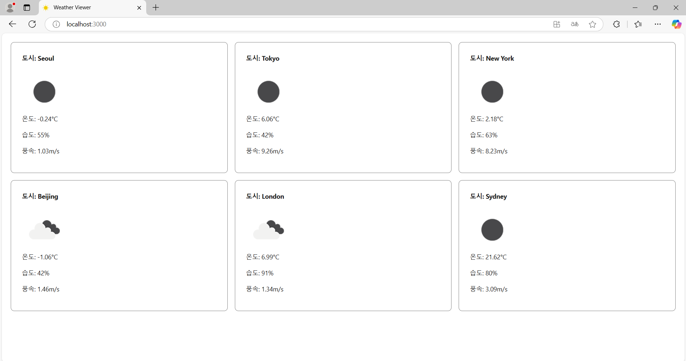

# 오픈소스 SW 텀 프로젝트 (Team: 50)

## 201835502 이지민

- 프로젝트 개요

  - OpenWeathermap API와 리액트를 이용해 세계 주요 도시의 날씨를 보여주는 웹 프로젝트

  - 도시의 날씨를 1분 단위로 업데이트 하도록 설정하였습니다.
    <br/>

- 데모 이미지
  

- 사용한 패키지와 버전

  - **react: 18.3.1**
  - **ant design : 5.22.4**
  - **dotenv: 16.4.7**

    <br />

- 실행 방법

  ```bash
      $ cd lee_jimin\weather-viewer
  ```

  ```bash
      $ npm start
  ```

  **⚠️ OpenWeathermap의 API키는 따로 제공하지 않으니 따로 준비하셔서 사용하시기 바랍니다.**

    <br />

- 참고자료
  - [OpenWeathermap API Documentation](https://openweathermap.org/api)
  - [React Documentation](https://reactjs.org/docs/getting-started.html)
  - [Ant Design Documentation](https://ant.design/docs/react/introduce)
  - [dotenv Documentation](https://www.npmjs.com/package/dotenv)
  - [리액트에서 API 키를 숨기는 방법](https://kybeen.tistory.com/104)

## 202134718 나원빈
202134718 나원빈 디렉토리에 있습니다.


## 이현서

- 프로젝트 개요
- 데모 이미지 및 영상
- 사용한 패키지와 버전
- 실행 방법
- 참고 자료


## 202232482 이호정

# 프로젝트명: Mask Detection

## 프로젝트 개요
Mask Detection 프로젝트는 얼굴 인식 모델을 활용하여 이미지 내 인물들이 마스크를 착용했는지 여부를 실시간으로 판단하는 오픈소스 프로젝트입니다. 본 프로젝트는 OpenCV와 Huggingface 라이브러리의 모델을 활용하여 마스크 착용 여부를 판별하고, 이를 이미지에 표시하는 기능을 제공합니다.

### 기능
- OpenCV를 사용한 얼굴 인식 및 마스크 착용 여부 판별.
- 사전 훈련된 딥러닝 모델을 사용한 마스크 착용 예측.
- 결과 이미지에 마스크 착용 여부를 시각적으로 표시.

## 사용한 패키지 및 버전
- **Huggingface Transformers**: 4.33.3
- **OpenCV**: 4.8.0
- **TensorFlow/Keras**: 2.14.0
- **NumPy**: 1.23.4

## 설치 방법
이 프로젝트는 `requirements.txt` 파일에 명시된 패키지를 설치하여 실행할 수 있습니다. 필요한 패키지를 설치하려면 아래 명령어를 사용하면됩니다.

```bash
pip install -r requirements.txt

## 데모 이미지 및 영상
프로젝트 실행 후 분석된 이미지를 아래와 같이 확인할 수 있습니다. 실행 예시 이미지는 다음과 같습니다.


- 사용한 패키지와 버전

- 실행 방법

### 1. 패키지 설치
먼저 필요한 패키지를 설치합니다. 프로젝트 디렉토리 내에 있는 `requirements.txt` 파일을 이용하여 패키지를 한 번에 설치할 수 있습니다:

```bash
pip install -r requirements.txt

0. 프로젝트 폴더로 이동:
cd C:\Users\ghwjd\face-mask-detection

2. 필요한 패키지 설치:
pip install -r requirements.txt

3. 이미지 분석 실행:
python main.py --image C:\Users\ghwjd\face-mask-detection\src\train_data\with_mask\image_name.jpg

- 이미지 분석 실행
프로젝트의 주요 Python 파일을 실행하여 이미지 분석을 시작합니다. main.py 파일을 실행하여 입력한 이미지를 분석할 수 있습니다:
<python main.py --image path_to_your_image.jpg>


- 참고 자료
- [Huggingface Transformers 문서](https://huggingface.co/docs/transformers/)
- [OpenCV 공식 문서](https://opencv.org/)
- [TensorFlow/Keras 공식 문서](https://www.tensorflow.org/learn)
- [GitHub에 업로드된 다른 프로젝트 예시](https://github.com/hojung025/mask-detection)
- https://kr.freepik.com/
- [분석된 이미지]([images/sample_output.jpg](https://kr.freepik.com/free-photo/asian-man-face-mask-mockup_15558455.htm#fromView=keyword&page=1&position=0&uuid=284078be-7e59-4ecc-8871-60e164688444))
- [분석된 이미지] https://kr.freepik.com/free-photo/asian-man-face-mask_15475120.htm#fromView=keyword&page=1&position=1&uuid=284078be-7e59-4ecc-8871-60e164688444
- [분석된 이미지] https://kr.freepik.com/free-photo/young-japanese-woman-wearing-mask_12707415.htm#fromView=keyword&page=1&position=4&uuid=4230e02c-d235-4df3-8771-302a50a2bb4d
